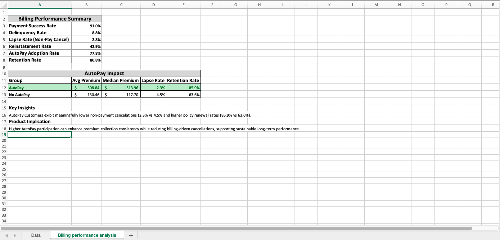
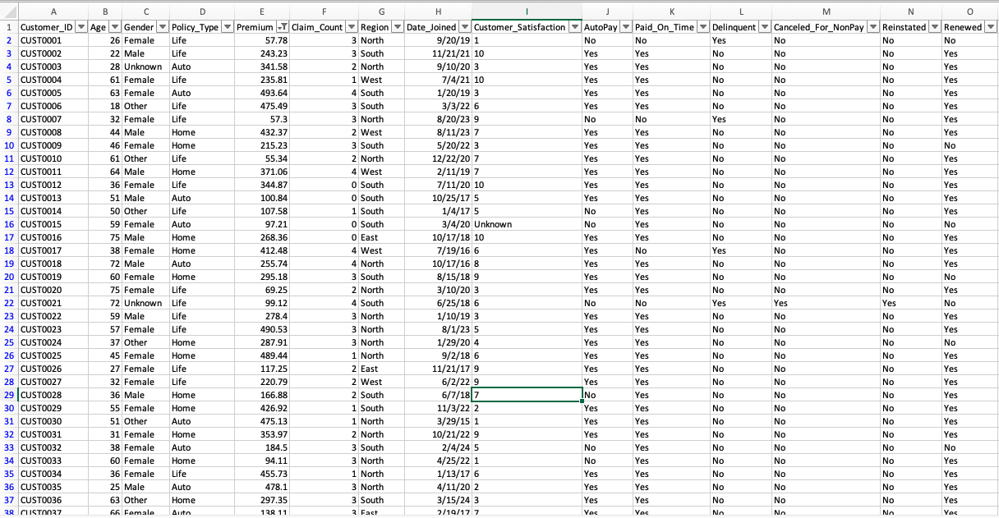

# Insurance Billing Performance Analysis (Excel)

This project uses Excel to analyze a synthetic insurance portfolio and evaluate billing behavior, retention, delinquency, and AutoPay adoption.

---

## 📸 Project Preview

### KPI Dashboard & AutoPay Impact

### Dataset & Engineered Billing Indicators

---

## 🎯 Project Goals
Build a business-focused Excel model that demonstrates:
- Data cleaning and validation
- Financial and billing KPI development
- Behavioral segmentation
- Dashboard reporting
- Data quality audit checks

---

## 🔧 Key Features

### Data Preparation
- Cleaned and standardized categorical variables (e.g., Gender)
- Identified and handled missing values and duplicates
- Flagged outliers using IQR methodology
- Engineered billing behavior indicators not present in the original dataset:
  - AutoPay  
  - Paid_On_Time  
  - Delinquent  
  - Canceled_For_NonPay  
  - Reinstated  
  - Renewed  

### KPI Dashboard
Built an executive-style dashboard including:
- Payment success rate
- Delinquency rate
- Lapse rate (non-pay cancellations)
- Reinstatement rate
- AutoPay adoption rate
- Retention rate
- AutoPay impact comparison

---

## 📈 Key Insights

- AutoPay customers showed meaningfully stronger billing performance.
- Non-payment cancellation rates were roughly **half as high** for AutoPay customers compared to non-AutoPay customers.
- Retention among AutoPay customers was over **20 percentage points higher**, indicating stronger long-term policy value.
- AutoPay customers also carried higher average premiums, suggesting reduced billing risk among higher-value policies.

These findings highlight how billing automation can improve revenue stability and reduce operational risk.

---

## 🛠 Tools Used
Microsoft Excel  
Formulas, Pivot Tables, Conditional Formatting, Data Validation

---

## 👤 Author
Christopher Bice
